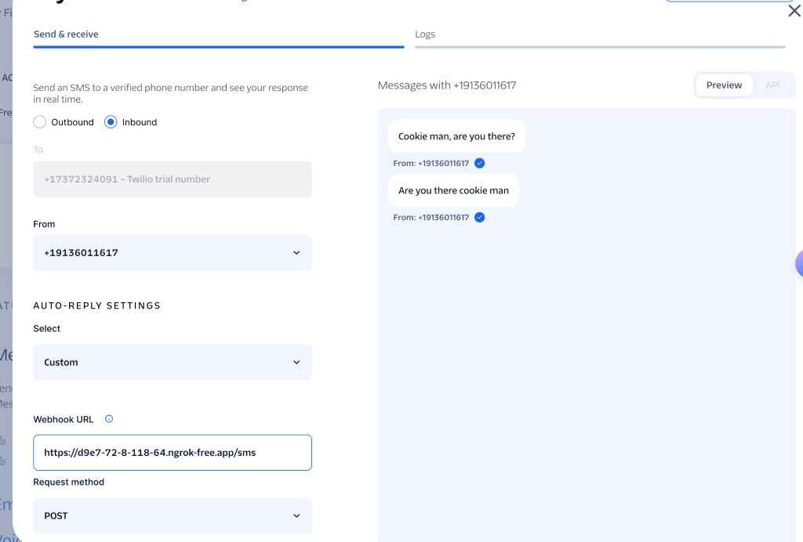
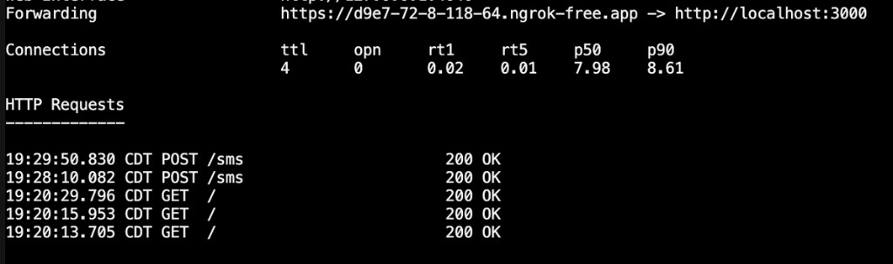

# The Cookie Man Text Bot

A Node.js practice project for working through **test-driven development**
and building a clean **abstraction boundary around external services**
(OpenAI and Twilio) that people can talk to as a fictional character,
**The Cookie Man**, over multiple transports.

This isn't a throwaway demo — it's a real, working app used to practice good
habits: strict separation between transport code, application logic, and
third-party providers, with everything except the actual providers covered
by automated tests.

## What it does

- Exposes a local HTTP `POST /chat` endpoint for talking to The Cookie Man.
- Exposes a Twilio-compatible `POST /sms` webhook so The Cookie Man can
  reply to real text messages, with Twilio request-signature verification
  enforced before anything else runs.
- Keeps the persona (personality, tone, world-building) in one centralized
  prompt module, shared by both transports.
- Keeps OpenAI entirely behind a swappable AI-provider interface — the rest
  of the app has no idea it's talking to OpenAI specifically, and a stub
  provider is used automatically when no API key is configured.

See `.cursor/rules/architecture.mdc` for the full layering rules this
project follows, and `PROJECT_STATUS.md` for a detailed, up-to-date account
of what's implemented.

## Status

Fully functional and manually verified end-to-end:

- Real replies from OpenAI (not the stub) via `POST /chat`.
- Real inbound SMS via Twilio, tunneled to a local server with `ngrok` and
  verified with genuine Twilio request signatures — see the screenshots
  below.

The one thing intentionally **not** done is registering a permanent Twilio
phone number, since that costs money for a practice project. The SMS test
below used a Twilio trial number and the "send a test SMS" tool in the
Twilio console, which exercises the exact same webhook a real text message
would.

### Proof it worked

Twilio console sending inbound test messages to the local `/sms` webhook
(via an `ngrok` tunnel), and The Cookie Man replying in character:



The `ngrok` tunnel log showing those webhook requests hitting the local
server and returning `200 OK`:



## Prerequisites

- Node.js 22+
- [Docker Desktop](https://www.docker.com/products/docker-desktop/) (optional, for the container workflow)

## Quick start (container)

Build and run the app in a container:

```bash
docker compose up --build
```

Visit [http://localhost:3000](http://localhost:3000). Health check: [http://localhost:3000/health](http://localhost:3000/health).

Stop with `Ctrl+C`, or run detached with `docker compose up -d --build` and stop with `docker compose down`.

## Local development (without Docker)

```bash
npm install
npm run dev
```

`npm run dev` uses Node's built-in `--watch` flag to restart on file changes.

## Running the tests

```bash
npm test
```

Runs the full suite with Node's built-in test runner (`node --test`). Tests
never call the real OpenAI API and never send a real SMS — external
services are always replaced with fakes/stubs, per `.cursor/rules/testing.mdc`.

## Environment configuration

Copy `.env.example` to `.env` and fill in real values — `.env` is gitignored
and must never be committed:

```bash
cp .env.example .env
```

`npm start` / `npm run dev` load `.env` automatically via Node's
`--env-file-if-exists` flag (no `dotenv` dependency needed).

- `OPENAI_API_KEY` — if set, the app uses the real OpenAI provider. If unset,
  it falls back to a stub AI provider outside of production (with a console
  warning) and refuses to start in production (`NODE_ENV=production`).
- `OPENAI_MODEL`, `PORT`, `HOST` — optional overrides; see `.env.example`
  for defaults.
- `TWILIO_AUTH_TOKEN` and `TWILIO_WEBHOOK_BASE_URL` — required together for
  `POST /sms` to accept anything. Without both set, `/sms` fails closed and
  rejects every request with `403`, rather than skipping signature
  verification.
- `TWILIO_ACCOUNT_SID` — only needed for a possible future outbound-sending
  feature; not used by signature validation.

### Trying `/sms` locally

Because Twilio needs a public URL to send webhooks to, testing `/sms`
against a locally running server requires a tunnel (e.g.
[ngrok](https://ngrok.com/)):

```bash
ngrok http 3000
```

Then set `TWILIO_WEBHOOK_BASE_URL` to the `https://…ngrok…` URL ngrok gives
you, point a Twilio phone number's (or the console's "send an inbound test
SMS" tool's) webhook at `<that-url>/sms`, and restart the app.

## How the container setup works

### `Dockerfile`

1. Starts from `node:22-alpine` (small Linux image with Node 22).
2. Copies `package.json` and installs dependencies with `npm ci`.
3. Copies application source into `/app`.
4. Runs as the non-root `node` user.
5. Exposes port 3000 and starts the app with `npm start`.

### `docker-compose.yml`

Compose is a convenience layer on top of Docker:

- **build** — builds the image from the `Dockerfile`.
- **ports** — maps host `3000` → container `3000`.
- **volumes** — mounts `./src` into the container so code changes apply without rebuilding (dev workflow).
- **command** — overrides the Dockerfile CMD to use `npm run dev` for auto-restart on changes.

### Production vs development

For production, build and run the image directly (no volume mount, no watch):

```bash
docker build -t cookie-man-text-bot .
docker run -p 3000:3000 cookie-man-text-bot
```

## Project structure

```
.
├── Dockerfile
├── docker-compose.yml
├── package.json
├── docs/
│   └── screenshots/          # proof-of-life screenshots referenced above
├── src/
│   ├── index.js               # composition entry point only — no app logic
│   ├── cookieMan/
│   │   ├── cookieManPrompt.js  # centralized persona definition
│   │   └── cookieManService.js # transport-agnostic Cookie Man behavior
│   ├── aiProviders/
│   │   ├── openaiProvider.js   # the only file that knows about OpenAI
│   │   ├── openaiConfig.js
│   │   └── stubAiProvider.js   # fallback when no API key is configured
│   ├── http/
│   │   └── createApp.js        # POST /chat and POST /sms transports
│   └── sms/
│       ├── verifyTwilioSignature.js
│       └── twilioRequestVerifier.js
└── tests/
    └── ...                     # one test file per module above
```
